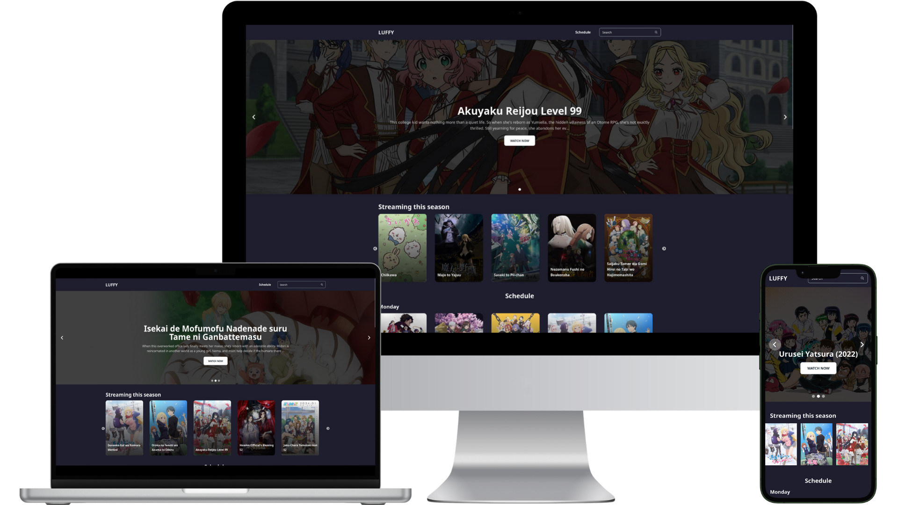
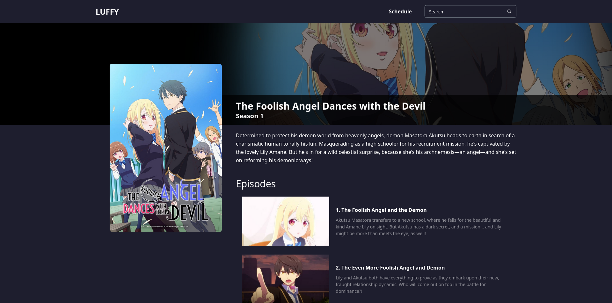

# luffy

> Self-hosted automatic torrents indexer for seasonal anime

<div align="center">

  <a href="https://github.com/davnpsh/luffy"></a>
  <a href="https://github.com/davnpsh/luffy/pkgs/container/luffy"></a>
  <a href="https://parceljs.org/"></a>
  <a href="https://coffeescript.org/"></a>
</div>

<br />

<div align="center">

  
</div>

## Notes

## Installation

For any of these installation methods, the UI is available at `http://127.0.0.1:4000`.

### docker compose (recommended)

If you have a good processor to host this app, you should try this method. If not, try the node.js method.

1. Install Docker and the Docker compose plugin.

2. Create a directory called `luffy` and create a `docker-compose.yml` file like this:

```yml
version: "3"

services:
  luffy:
    image: ghcr.io/davnpsh/luffy:experimental
    ports:
      - "4000:4000"
    environment:
      # Your TheMovieDB api key:
      - TMDB_API_KEY=
    # Map this volume if you want to control the data about episodes
    # inside the container
    volumes:
      - ./episodes:/usr/src/luffy/public
```

3. Inside that folder, run:

```sh
docker compose up -d
```

### Docker build

If you want to build the image by yourself, follow these steps:

1. Install Docker.

2. Clone this repository:

```sh
git clone https://github.com/davnpsh/luffy.git
```

3. Inside the project directory build the image (replace `IMAGE_NAME` and `TAG` for whatever you like):

```sh
docker build -t IMAGE_NAME:TAG .
```

4. Create and run a container with the app:

```sh
docker run -p 4000:4000 -e TMDB_API_KEY=$ENV_VAR IMAGE_NAME:TAG
```

Where `$ENV_VAR` is your TheMovieDB api key.

### node.js

This project was developed with node.js version 21.5.0. If using a prior version, make sure at least dependencies are up-to-date. You MUST also **install a web browser compatible with [Puppeteer](https://pptr.dev/)** (Chromium recommended).

1. Install node.js and npm.

2. Clone this repository:

```sh
git clone https://github.com/davnpsh/luffy.git
```

3. Inside the project directory, install dependencies:

```sh
npm install
```

4. Create a `.env` file in the root of the project with your TheMovieDB api key:

```text
TMDB_API_KEY=your_api_key
```

5. Run the project with:

```sh
npm run bundle
```

## Screenshots

<div align="center">

### Homepage

  

### Gallery

  

### Show details

  
</div>

## Credits
